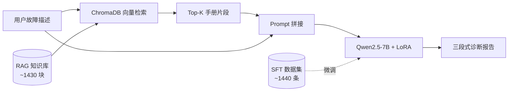

# CNC 故障诊断智能助手

基于 **Qwen2.5-7B-Instruct LoRA 微调** + **ChromaDB RAG** 的数控机床故障诊断助手。  
输入机床系统、报警代码与故障现象，输出结构化诊断报告：**【可能原因】【排查步骤】【处理建议】**。

[](https://huggingface.co/wc8084/cnc-qwen2.5-7b-lora)
[](https://github.com/wce5336-cyber/CNC-fault-diagnosis-assistant)
[](https://www.python.org/)
[](LICENSE)

> **作者：** WCE  
> **代码仓库：** [wce5336-cyber/CNC-fault-diagnosis-assistant](https://github.com/wce5336-cyber/CNC-fault-diagnosis-assistant)  
> **模型权重：** [Hugging Face · wc8084/cnc-qwen2.5-7b-lora](https://huggingface.co/wc8084/cnc-qwen2.5-7b-lora)

---

## 特性

- 面向 **FANUC / Siemens 840D** 报警与中文维修场景的结构化诊断
- **LoRA 微调** 学习三段式输出格式与领域表达
- **ChromaDB RAG** 检索报警手册，降低幻觉与重复生成
- 提供 CLI、Gradio Demo、对比评测与 GitHub Actions 冒烟测试

---

## 架构



| 模块 | 技术 | 作用 |
|------|------|------|
| 微调 (SFT) | LoRA · Qwen2.5-7B-Instruct | 学习诊断格式与领域表达 |
| RAG | ChromaDB + bge-small-zh-v1.5 | 检索 FANUC/Siemens 报警与维修手册 |
| 推理 | LLaMA-Factory WebUI API | 加载 LoRA 生成回答 |

**分工：** SFT 学「怎么写」→ RAG 补「写什么」。

---

## 项目结构

```
cnc-fault-diagnosis-assistant/   # GitHub 仓库名
├── .github/workflows/        # CI 冒烟测试
├── README.md
├── LICENSE
├── environment.yml           # Conda 环境
├── requirements.txt
├── setup_env.bat             # Windows 一键建环境
├── docs/
│   ├── MODEL.md              # 模型下载与加载
│   └── HF_MODEL_CARD.md      # Hugging Face Model Card
├── data/
│   └── external_knowledge/   # 报警手册源数据（raw / parsed / manuals）
├── models/                   # LoRA 权重目录（.gitignore，从 HF 下载）
├── processed/                # 构建产物
│   ├── cnc_diagnosis_sft.json
│   ├── rag_knowledge/chunks.jsonl
│   ├── rag_chroma/           # 向量库（本地生成，不入 Git）
│   └── eval_rag_compare_report.md
└── src/                      # 应用代码
    ├── process_cnc_datasets.py
    ├── build_rag_index.py
    ├── rag_chat.py
    ├── demo_app.py
    ├── eval_rag_compare.py
    └── smoke_test.py
```

> LoRA 权重发布在 Hugging Face，**不包含在本仓库**。下载至 `models/qwen2.5-7b-lora/`。

---

## 快速开始

> **工作目录：** 克隆后进入**项目根目录**，所有命令使用 `python -m src.xxx`。

### 环境要求

| 项 | 说明 |
|----|------|
| Python | 3.11（推荐 conda 环境 `qx`） |
| GPU | RAG 嵌入可 CPU；LLM 推理需 GPU + LLaMA-Factory |
| LLaMA-Factory | 单独安装，WebUI 默认 `http://127.0.0.1:7860` |

### 1. 克隆与环境

```bash
git clone https://github.com/wce5336-cyber/CNC-fault-diagnosis-assistant.git
cd CNC-fault-diagnosis-assistant

conda env create -f environment.yml
conda activate qx
# Windows 也可双击 setup_env.bat
```

### 2. 下载模型

```bash
hf download wc8084/cnc-qwen2.5-7b-lora --local-dir models/qwen2.5-7b-lora
```

### 3. 构建数据与 RAG 索引

```bash
python -m src.process_cnc_datasets
python -m src.build_rag_index --reset
```

### 4. 离线冒烟测试

```bash
python -m src.smoke_test --check-llm
```

### 5. 启动 LLaMA-Factory 并加载 LoRA

| 项 | 值 |
|----|-----|
| 基座模型 | Qwen2.5-7B-Instruct |
| 微调方法 | LoRA |
| Adapter | `models/qwen2.5-7b-lora` 或同步至 LLaMA-Factory LoRA 目录 |

```bash
set CNC_BASE_MODEL=Qwen/Qwen2.5-7B-Instruct   # Windows
export CNC_BASE_MODEL=/path/to/Qwen2.5-7B-Instruct  # Linux
```

### 6. 运行 Demo / CLI

```bash
python -m src.demo_app --skip-load --port 7861
python -m src.rag_chat --skip-load --interactive
```

### 常见问题

| 现象 | 处理 |
|------|------|
| `Could not fetch config for 127.0.0.1:7860` | 启动 LLaMA-Factory 后加 `--skip-load` |
| ChromaDB 为空 | `python -m src.build_rag_index --reset` |
| 模块找不到 | 确认在项目根目录，使用 `python -m src.xxx` |

---

## 推荐 System Prompt

```
你是CNC故障诊断智能助手，由WCE开发，专注于数控机床报警解读、故障诊断与维修建议。
请严格依据参考知识进行分析，输出必须包含【可能原因】【排查步骤】【处理建议】。
不要称自己为通义千问或 Qwen。
```

---

## 评测结果

```bash
python -m src.eval_rag_compare --num-samples 40 --skip-load
python -m src.eval_rag_compare --recompute processed/eval_rag_compare.json --update-readme
```

<!-- EVAL:START -->
基于分层抽样 **n=6** 的对比评测（详见 [eval_rag_compare_report.md](processed/eval_rag_compare_report.md)）：

| 指标 | 仅 LoRA | RAG + LoRA |
|------|---------|------------|
| 综合可用率¹ | 33% | **67%** |
| 三段式格式通过率 | 33% | **67%** |
| 关键词召回率² | 35% | **68%** |
| 循环重复率³ | 67% | **33%** |

¹ 综合可用率 = 格式完整 + 无循环重复 + 长度正常 + 报警码命中（如有）。

**按类别：** RAG 在 通用故障 / 传感器/产线 提升最明显；Siemens 840D 仍需优化。
<!-- EVAL:END -->

---

## 数据集

| 来源 | 规模 |
|------|------|
| FANUC 报警 | 350 |
| Siemens 840D 报警 | 350 |
| 中文维修手册 | 10 |
| ai4i2020 标准故障类型 | 10 |
| instruction 变体扩增后 | **~1440 条** |

微调数据：`processed/cnc_diagnosis_sft.json`（Alpaca 格式，见 [docs/MODEL.md](docs/MODEL.md)）

---

## 技术栈

| 类别 | 选型 |
|------|------|
| 基座 LLM | Qwen2.5-7B-Instruct |
| 微调 | LoRA（LLaMA-Factory） |
| RAG | ChromaDB + bge-small-zh-v1.5 |
| Demo | Gradio |
| CI | GitHub Actions 离线冒烟 |

---

## 已知局限

- 自我认知需配合 System Prompt
- 单轮诊断，不支持多轮追问
- FANUC 部分报警文本存在 PDF 解析截断
- Demo 推理依赖 LLaMA-Factory WebUI API
- **不能替代**厂商官方手册与现场工程师判断

---

## 相关链接

- 模型权重：[wc8084/cnc-qwen2.5-7b-lora](https://huggingface.co/wc8084/cnc-qwen2.5-7b-lora)
- 基座模型：[Qwen/Qwen2.5-7B-Instruct](https://huggingface.co/Qwen/Qwen2.5-7B-Instruct)
- 微调框架：[LLaMA-Factory](https://github.com/hiyouga/LLaMA-Factory)

---

## License

[MIT](LICENSE) · 数据来源于公开报警手册与自建清洗流程；仅供学习与研究使用。
